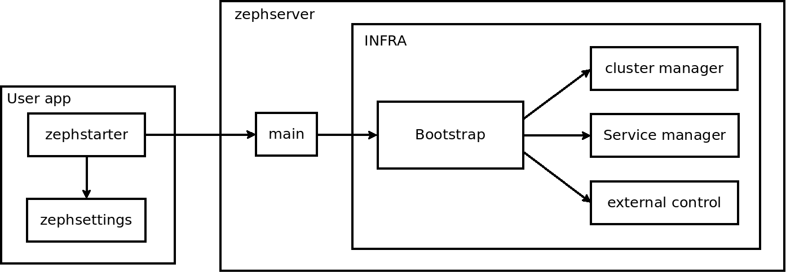

==========
Zephserver
==========
-------------------------------------------------------------
Python service manager that can be used as a WebSocket server 
-------------------------------------------------------------
Zephserver is an easy to use websocket server written in python.

It can also be used as a simple service manager to work on things that have nothing to see with the web.

Infrastructure
==============
The basic infrastructure for zephserver is a service manager with a cluster manager.

There are four parts to build the service manager: bootstrap, cluster_manager, external_control and service_manager.

Bootstrap
---------
This is the first module called at startup.

If you use zephserver as an independent software you don't need to understand how this class works.

As its name says this module manage the startup and the destruction of the server. The module is located in the folder infra and can be called if you wand to start zephserver inside an other program. For any other cases it is strongly recommended to use the main.py file which build and configure the environment for the server.

To start the server call the *start_server* method, it will check if there is a lock (to avoid launching two servers with the same configuration), configure the logger and launch the different parts in the correct order.

To stop the server call the *command_stop* method which will launch the stop procedure.

This module needs the **LOCK_FILE** variable in settings to know where it can leave a lock.

The variables **LOG_LEVEL** and **LOG_PATH** are optional. By default there value are 'INFO' and './logging.log'. 

Cluster_manager
---------------
This module manages the cluster.

A simple description of the cluster manager could be you say that it permit you to trigger event on all the servers of the cluster (except the one launching the event).

It needs the **CLUSTER_SERVER_LIST** variable in the settings to be able to build the cluster. If this variable is empty or composed by only one element, there will not be a cluster. In that case the cluster manager will do nothing when you call the api function (and therefore always successfully send messages).

If the **CLUSTER_SERVER_LIST** contains more than one element (one by server in the cluster including the current server), you can send an event to the whole cluster by calling the *say* method. The first parameter is a string containing the name of the event, the second parameter is a serializable object which will be passed to the subscribers.

To subscribe to an event call the *subscribe* method passing the name of the event as first argument and the function as the second to call when the event is triggered. The function must accept at least one argument. The argument passed to the subscriber is the called in the cluster_manager thread (so, it have to have a short execution time) and it will get the deserialized object as argument.

**CAUTION** : there is currently no way to unsubscribe from an event so don't use it in the tasks or other objects with short lifespan.

External_control
----------------
This module provide a simple way to administrate the server.

This module receive commands via an UNIX socket. There is currently only one command accepted : stop. It is the only way to cleanly stop the server.

This module needs the **CONFIGURATION_NETWORK_INTERFACE_SERVER** variable in settings to know where to listen for commands. Currently, only UNIX sockets (files path) are supported

Service_manager
---------------
The Service manager is the main module of this part of zephserver. It manage the lifecycle of all the services, give access to them and try to resurrect them when they die.

A service can be in two differents state : available and enabeled.

A service available is a service which is instancied but its thread is not launched.

A service enabled is a service which whose thread is running.

The service manager encapsulate the services in a class to be able to manage the life cycle (entering, exiting a category) and it give the possibility to enable a thread which was already enabeled in the past (we resurrect it) without having to reinstaciate this service.

The main public api for this module is the function *get_service* which take only one argument : a string containing the name of the service (example : 'zephserver.service.clientsocket_service/StartClientSocket').

This module needs the **SERVICE_LIST** variable in the settings file. This variable is the list of services with the form 'path.to.module/ClassName'

Service
-------
A service is a python class with the methods *__init__(self)*, *main(self)*, and *disable(self)*. A service must be registred in the **SERVICE_LIST** variable to be launched.

*__init__(self)* is a basic constructor, the only constraint is to not call other services in this function. when it will be called, the other services could not be created yet.

*main(self)* works exactly like the run(self) method of a thread. The only difference is when it dies, and if it is not the disabeling procedure, the service manager will try to relaunch the main method in an other thread if the service is called (via the *get_service(service_name)* method).

*disable(self)* is called when the service manager wants the service to stop. It must stop quickly because the service manager waits for the join to continue its operations.

Websocket server
================

The websocket server uses the service manager infrastructure to build a websocket server. It can also be seen as an example of how to use the service manager.

A simplified version of a request life cycle can be pictured like :

.. image :: images/zephwebserver.bmp

The websocket is composed by 4 services : websocket_client, session_manager, room_handler and router

Websocket_client
----------------
This part handle the websocket connection and dispatch the tasks to the router service. It also recover the session from the session service and call the roomhandler service to create a room if it does not exist and store the user client inside.

Session_manager
---------------
The session manager recover a session from the client side. For the moment the one used inside the server is for django, it return the user object from the request. 
You can implement your own session manager and then change the variable in the zephserversttings.py to indicate the path of your service. If you do that you need to implement the get_user_session(instance, message) with this two parameters. It should return a user object with an id and a username (it can be anonymous).

Room_handler
------------
The room handler creates a room with all the informations we need, like the user, the connection and it creates a unique id for each connections.
You can implement your own room handler and then change the variable in the zephserversttings.py to indicate the path of your service.

Router
------
The router service receives the request from the websocket service and launch a task to execute it.

This service select the correct task to launch, manage the security (with a decorator on the task constructor) and manage the task life cycle. 

It uses the variable **TASKS_PATH** from the configuration file to list the task and get there names.

Task
----
It is the basic unit of the websocket server. It is the equivalent of the view in django. Each task run in a thread and each instance of a task is isolated. Unlike the services it is impossible to call a task running and everything in a task is made in a separate thread (from instantiation to death).

Each task is a class with the methods *__init__(self, request)*, *main(self)*, *interrupt(self)*.

*__init__(self, request)* is the constructor. It receive a Request which is a dict with a 'data' key containing the data sent by the webclisent. It also contain a 'cid', the id of the connection, a 'user' key and the 'task'. 

*main(self)*: as for the services the main method works exactly like the run method of a thread.

*interrupt(self)*: a method to kill the task. Generaly it is not used but if your task can be very long to execute it can be a good idea to implement it if you wants the server to shutdown fast.

Command
=======
You can control a running server by using the zephserver-* commands. More documentation on these commands here_

.. _here: command.html